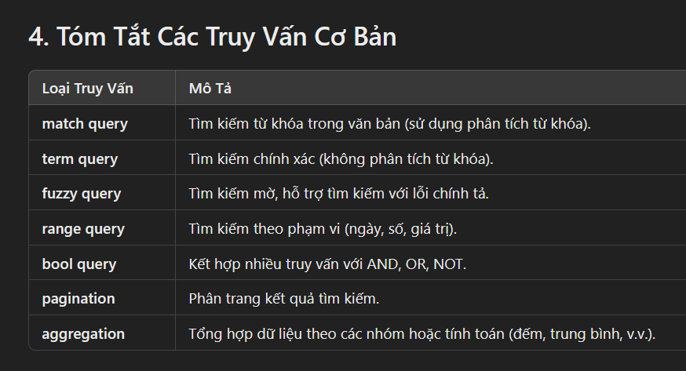

# Hướng Dẫn Sử Dụng Elasticsearch Cơ Bản

## 1. Giới Thiệu Elasticsearch

Elasticsearch là một công cụ tìm kiếm mạnh mẽ, phân tán và mã nguồn mở. Nó sử dụng Lucene để cung cấp khả năng tìm kiếm văn bản toàn văn, phân tích dữ liệu và tối ưu hóa hiệu suất.

- **Chỉ mục (Index)**: Tương tự như cơ sở dữ liệu trong hệ quản trị cơ sở dữ liệu.
- **Tài liệu (Document)**: Một bản ghi đơn trong Elasticsearch, lưu trữ dưới dạng JSON.
- **Trường (Field)**: Một phần dữ liệu của tài liệu, tương tự như cột trong cơ sở dữ liệu.

## 2. Cài Đặt Elasticsearch

### Cài Đặt trên Windows, macOS, Linux, hoặc Docker
Truy cập tài liệu chính thức của Elasticsearch để tìm hướng dẫn chi tiết về cách cài đặt:

- [Tài liệu cài đặt Elasticsearch](https://www.elastic.co/guide/en/elasticsearch/reference/index.html)

Sau khi cài đặt, bạn có thể kiểm tra kết nối đến Elasticsearch bằng cách truy cập `http://localhost:9200` trong trình duyệt.

## 3. Các Truy Vấn Cơ Bản

### 3.1. Truy Vấn Tìm Kiếm (Search Query)

Để tìm kiếm tài liệu trong Elasticsearch, bạn sử dụng API `search`. Một truy vấn tìm kiếm cơ bản có thể trông như sau:

```json
GET /index_name/_search
{
  "query": {
    "match": {
      "field_name": "search_value"
    }
  }
}


#Tìm kiếm tất cả các tài liệu có trường title chứa từ khóa "Elasticsearch":

GET /articles/_search
{
  "query": {
    "match": {
      "title": "Elasticsearch"
    }
  }
}


### 3.2. Truy Vấn Tìm Kiếm Chính Xác (Term Query)

Truy vấn term tìm các tài liệu có giá trị chính xác trong trường. Điều này có nghĩa là không phân tích từ khóa.

Ví dụ:
Tìm các tài liệu có trường category có giá trị chính xác "technology":

GET /articles/_search
{
  "query": {
    "term": {
      "category": "technology"
    }
  }
}


###############   3.3. Truy Vấn Mờ (Fuzzy Query) #################################

Fuzzy query cho phép tìm kiếm với lỗi chính tả hoặc sự thay đổi nhỏ trong từ khóa.

Ví dụ:

Tìm các tài liệu có từ "Elastcsearch" (lỗi chính tả của "Elasticsearch"):

GET /articles/_search
{
  "query": {
    "fuzzy": {
      "title": {
        "value": "Elastcsearch",
        "fuzziness": "AUTO"
      }
    }
  }
}


###################### 3.4. Truy Vấn Phạm Vi (Range Query) ###########################

Truy vấn range cho phép tìm kiếm trong một phạm vi giá trị, chẳng hạn như tìm kiếm theo ngày tháng hoặc số liệu.

Ví dụ:

Tìm các bài viết có published_date trong khoảng từ 2021-01-01 đến 2022-01-01:

GET /articles/_search
{
  "query": {
    "range": {
      "published_date": {
        "gte": "2021-01-01",
        "lte": "2022-01-01"
      }
    }
  }
}





